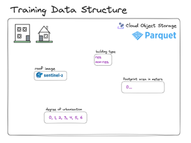

# Training Data Curation

## Data Collection

To train any model a sufficient amount of high-quality data is required, for which we know the anticipated outcome of the model. In the case of Open Building Insights this data set consists of buildings, for which we know their type, i.e., we know whether the building is residential or non-residential. This chapter provides an overview of the data collection process.

The main dataset for training the model consists of [Sentinel-2](https://sentinel.esa.int/web/sentinel/missions/sentinel-2) Satellite images, obtained from the [Cloud Optimized GeoTIFF](https://registry.opendata.aws/sentinel-2-l2a-cogs/) s3 bucket. Furthermore, data from [Open Streep Map (OSM)](https://www.openstreetmap.org) is used to derive the type of buildings. Each building on the Sentinel-2 images is, if also contained in the OSM data, labelled as either **residential** or **non-residential**. The resulting labelled data set is used for training, validation and testing of the model. The resulting labelled data set is stored as Parquet files in an IBM Cloud Object Storage, used for model training and testing purposes only.

<figure>
  
  <figcaption>Figure 1: Structure of training data stored using a Parquet format in a COS bucket</figcaption>
</figure>

To curate the training data set such process is required to obtain building labels from OSM with high-confidence, to avoid introducing too much noise for the training of the model. The method used to collect labelled building data based on OSM (directly or indirectly) is described in what follows. Three tools were used during this process: [Open Streep Map (OSM)](https://www.openstreetmap.org), [Overture Maps](https://overturemaps.org) and [Overpass Turbo](https://overpass-turbo.eu) enabling efficient querying OSM data.

Labelled training data is obtained based on three different sources:
- Building labels
- Area based tags/labels
- Obtain information from nodes (points) in OSM, in particular based on node location relative to buildings:
  - Nodes present inside of building boundaries
  - Nodes present outside of building boundaries, close to the building entrance

Once all of these options are processed the resulting data sets are merged and duplicities are removed.

### Collect Labelled Buildings

To obtain labelled training data based on building labels is straightforward both from OSM directly as well as using Overture Maps. The one caveat of this process to look out for transitional labels, such as **foundation** or **construction**, which may depict residential and non-residential buildings alike, while introducing noise to the model as their related image would depict a construction site rather than a completed building.

### Obtaining Labelled Buildings Based on Area Labels

On several occasions OSM amenity or healthcare tags delineate larger areas encompassing several buildings. This larger area can be a school campus a hospital complex of several buildings or a police station with dedicated buildings to different police facilities. These large areas can be cross-referenced with unlabeled buildings to obtain a more robust training data set by labelling buildings residing inside the aforementioned areas.

Starting from unlabeled buildings, it is possible to use the VIDA building data set to obtain these additional buildings as the VIDA data set is more robust compared to OSM. To avoid introducing too much noise a careful selection of building footprints is required, in this collection only such buildings from VIDA are cross-referenced with OSM areas, which are having at least 0.9 VIDA confidence.

Additionally, not all area-based amenity tags are used, especially `police` and `university` tags tend to delineate huge areas, including auxiliary buildings, parking lots, parks and possibly surrounding buildings as well, therefore these tags are not used to derive additional labelled building information.

The OSM `industrial`, `commercial` and `retail landuse` can be cross-referenced with the VIDA building footprint catalog in a similar fashion. These landuse options are restricting enough to avoid introducing too much residential buildings into the non-residential training labelled data set as it is rare to allow residential structure in industrial parks or business districts. The filter of VIDA confidence 0.9 and above is employed.

The `residential landuse` category, in particular, is not used to derive additional labelled buildings, as it is not sufficiently strict by definition. Several non-residential buildings can be found in residential districts, such as places of worship, smaller shops, hotels or stand-alone garages just to name some examples.

**Lesson learned:** The limit of 0.9 VIDE confidence and higher was obtained by empirical testing, starting from the limit 0.8 and increasing the confidence slowly, cross-referencing the obtained building footprints from VIDA with high-resolution imagery to see how precise the building footprints are.

As a result of empirical testing the limit 0.9 was chosen as it still provided a robust data set, with very few incorrectly defined buildings, which could be considered a noise.

### Obtaining Labelled Data Based on Nodes Inside Building Footprint Polygons

The idea of this section is similar to the one above, cross referencing information, which is not directly related to buildings allows the creation of additional labelled buildings for training purposes. In this section those OSM tags are explored, which are denoted as nodes in the OSM database. Given the voluntary nature of OSM and the much smaller effort to record nodes compared to polygons several amenities are denoted only as nodes.

These nodes represent additional information about nearby buildings, which can be harvested if the node is "connected" with high confidence to a particular building.

For this options OSM nodes are compared only to buildings inside the OSM database, they are not cross-referenced with VIDA. This is done due to the following two reasons:
- The OSM nodes are meant to be read in the context of the OSM building footprint catalog, therefore they are placed relatively "close" to the building boundaries creating a logical coupling of nodes with the building it represents.
- The VIDA building catalog is created by an AI and as such it is more robust, but it can have small shifts compared to OSM building locations due other factors, such as shadows. These small shifts are negligible when comparing buildings to large areas as in the section above, but can cause incorrect associations when compared to points. In theory a shift of 2-3 meters can cause a point to be associated with an incorrect building, a neighbour of the building it refers to.

In the case a node resides inside a boundary of a building it is safe to assume, that the node provides additional information about the given building. Such nodes can be "translated" to the buildings they reside in using the following code in Overpass Turbo:

    // for the next code the timeout must be increased
    [out:json][timeout:100];

    // fetch area of interest to search in
    {{geocodeArea:Nairobi}}->.searchArea;

    // gather nodes of interest
    node["amenity"="fuel"](area.searchArea)->.interest;

    // find those buildings, which contain the node
    .interest is_in ->.enclosing;
    wr(pivot.enclosing)["building"];

    // print results
    out geom;

### Obtaining Labelled Data Based on Nodes Near Building Footprints

In the case nodes are not directly inside the building polygon an ambiguity in the association between building and nodes raises naturally. There can be many reasons, why these points are not directly inside the building, but the main reason is, that for human users the points are still incredibly useful. Imagine a person searching for a hotel, it can drive to the parking lot denoted by the node and find the building in question simply by looking around.

Such ambiguity must be resolved algorithmically by computers. To keep things simple and to avoid introducing too much noise, it has been decided to associate nodes with buildings, which are at most one meter from the node. With this radius it is still rare to obtain more than one building in the immediate proximity of the node, so the amount of noise is minimized, while obtaining additional labelled buildings for training.

The following Overpass Turbo Code snippet finds all buildings near to a point in OSM:

    // for the next code the timeout must be increased
    [out:json][timeout:100];

    // fetch area of interest to search in
    {{geocodeArea:Nairobi}}->.searchArea;
    
    // gather nodes of interest
    node["amenity"="fuel"](area.searchArea)->.interest;

    // gathering all buildings in the search area
    wr["building"](area.searchArea)->.buildings;

    // finding all buildings, which are at most 1 meter away from a node
    wr.buildings(around.interest:1);

    // print results
    out geom;

During testing of ideas presented above around 45% of different nodes were translated to building footprints in the area of Nairobi using the last two methods. One of the possible reasons is depicted in [Figure 2](data-curation/README.md#ambiguity_of_nodes), where nodes are far removed from any buildings and visibly denotate parking lots or squares.

<figure>
  
  <figcaption>Figure 2: The "Voice of Salvation" and "St. Sam Roho Lwanda" churches are ambiguously denoted in OSM</figcaption>
</figure>

### Removing Non-Residential Bias

The last three methods above mainly increase the amount of non-residential labelled building data, while residential buildings are usually directly obtained from OSM or Overture Maps using the first method. This can lead to obtaining more non-residential labelled buildings than residential ones, especially `Industrial landuse` can lead to tens of thousands of newly labelled non-residential buildings as industrial parks tend to be larger. This can create unwanted bias in the training data set.

To combat this bias in the State of Maharashtra in India only a randomly selected half of all industrial buildings were used for training purposes to balance the different tags inside the data set.

In Kenya the amount of industrial buildings were not surpassing those of the other sources.

### Lack of Labelled Buildings

OSM is community driven by nature and as such for countries with small amount of OSM volunteers even the method above can result in insufficient amount of labelled building data.

One possible suggestion discussed during the data collection ideation is to include labelled building data from neighbouring countries, especially those, which have similar architecture to the country in question. This solution can increase the amount of labelled data for additional computational resources needed to process selected neighbouring countries as a trade-off.

## Data Pre-processing

The labelled building data set is enriched by additional attributes, which are used as inputs during the model training, see Chapter [Machine Learning Model](../machine_learning/README.md) for further details.

Currently two attributes are used as input for the machine learning model, aside from the roof image obtained from Sentinel-2. These attributes are the footprint area in square meters and the degree of urbanization as defined in the GHSL-SMOD product (translated to numbers for the training process).

The footprint area is computed directly from the polygon of the building footprint obtained from OSM, Overturemaps or VIDA. The degree of urbanization is obtained similarly to the GHSL-SMOD ingestion during the Data Pre-processing as described in Section [Urban/Rural Classification](../data-preprocessing/README.md#urban_rural_section).

Two additional ideas were explored, but eventually dropped.

First, building height was considered as a feasible input for the machine learning model, but this idea was discarded as in the areas of interest vast majority of buildings is a single story structure, this information therefore provides little to no additional information for the model.

Second, it was considered how far buildings lay form major crossroads. This idea was supported by the results of the Level2 classification Proof of Concept inside Nairobi as proximity to major crossroads lowered the chance the building would be residential. This idea was dropped during scaling the model up to the entire country as major crossroads were rare outside of major cities leaving substantial amount of the labelled data set for Kenya or India missing this information.

## Implementation Details

The list of most important libraries is provided:

| Package Name | Version | Short Description |
| --- | --- | --- |
| getpass | 1.0.2 | Portable password input |
| jaydebeapi | 1.2.3 | Use JDBC database drivers from Python 2/3 or Jython with a DB-API. |
| jpype | 1.4.1 | A Python to Java bridge. |
| json | default | A library to work with JSON documents. |
| geopandas | 1.0.1 | Geographic pandas extensions |
| pandas | 1.5.3 | Powerful data structures for data analysis, time series, and statistics |
| pyproj | 3.6.1 | Python interface to PROJ (cartographic projections and coordinate transformations library) |
| shapely | 2.0.5 | Manipulation and analysis of geometric objects |
| overpy | 0.7 | Python Wrapper to access the OpenStreepMap Overpass API |
| plotly | 5.9.0 | An open-source, interactive data visualization library for Python |
| numpy | 1.23.5 | Fundamental package for array computing in Python |
| duckdb | 1.0.0 | DuckDB in-process database |
| requests | 2.31.0 | Python HTTP for Humans. |
| PIL | 10.4.0 | Python Imaging Library |
| ibm_boto3 |  | The IBM SDK for Python |
| botocore | 1.27.59 | Low-level, data-driven core of boto 3. |
| ibm_cloud_sdk_core | 3.20.3 | Core library used by SDKs for IBM Cloud Services |
| threading | default | Standard threading module |
| rasterio | 1.3.10 | Fast and direct raster I/O for use with Numpy and SciPy |

OverPass provides a dedicated package to query data sing Python. This package supports the XML-like query format, not the more human-readable format used in the web interface presented in the sections above for convenience. An example of an XML query is presented for the sake of interest:

    template = f'''
        <osm-script bbox="{bbox[1][0]},{bbox[0][0]},{bbox[1][1]},{bbox[0][1]}">
            <query into="interest" type="node">
                <has-kv k="amenity" modv="" v="{amenity}"/>
                <bbox-query s="{bbox[1][0]}" w="{bbox[0][0]}" n="{bbox[1][1]}" e="{bbox[0][1]}"/>
            </query>
            <query into="buildings" type="wr">
                <has-kv k="building" modv="" v=""/>
                <bbox-query s="{bbox[1][0]}" w="{bbox[0][0]}" n="{bbox[1][1]}" e="{bbox[0][1]}"/>
            </query>
            <query into="buildings_found" type="wr">
                <item from="buildings" into="_"/>
                <around from="interest" radius="1"/>
            </query>
            <query into="buildings_of_interest" type="nwr">
                <has-kv k="amenity" modv="" v="{amenity}"/>
                <has-kv k="building" modv="" v="yes"/>
                <bbox-query s="{bbox[1][0]}" w="{bbox[0][0]}" n="{bbox[1][1]}" e="{bbox[0][1]}"/>
            </query>
            <coord-query from="interest" into="enclosing" lat="" lon=""/>
            <query into="buildings_mark_inside" type="wr">
                <has-kv k="building" modv="" v=""/>
                <pivot from="enclosing"/>
            </query>
            <union into="_">
                <item from="buildings_found" into="_"/>
                <item from="buildings_of_interest" into="_"/>
                <item from="buildings_mark_inside" into="_"/>
            </union>
            <print e="" from="_" geometry="full" ids="yes" limit="" mode="body" n="" order="id" s="" w=""/>
            </osm-script>
        '''

Overturemaps provides its building footprint data in an s3 bucket, which contains all data in a Parquet format. To load only data for a given country duckDB is employed to filter data from the s3 bucket. DuckDB is installed as a package and imported to Python, allowing SQL-like filtering of Paquet files in s3:

    db = duckdb.connect()
    db.execute("INSTALL spatial")
    db.execute("INSTALL httpfs")
    db.execute("""
    LOAD spatial;
    LOAD httpfs;
    SET s3_region='us-west-2';
    """)

    data = db.execute("""
    select
      *
    from
      read_parquet('s3://overturemaps-us-west-2/release/2024-03-12-alpha.0/theme=buildings/type=building/*', filename=true, hive_partitioning=1)
    where
      bbox.minx > 33.513685289475745
      and bbox.maxx < 42.13960990394747
      and bbox.miny > -5.002337968311068
      and bbox.maxy < 4.890687834041984
      and class != ''
    """).fetchall()

## Execution Details

To execute the data curation process the following notebooks are executed in order:

1.	1_fetch_OSM_data_from_DB2.ipynb
2.	2_buildings_filter_special_entries.ipynb
3.	3_buildings_filter_special_entries_nodes.ipynb
4.	4_fetch_buildings_from_overture.ipynb
5.	5_overlapping_revoval.ipynb
6.	6_SMOD_caclulation.ipynb 
7.	7_building_height_calculation_parquet_ver.ipynb
8.	8_Sentinel2_cropping.ipynb
9.	9_data_labeling.ipynb

## Access to Training Data Sets

Data sets curated by the approach described in this chapter and used for machine learning are published in Github on [this](../machine_learning/datasets/) location.